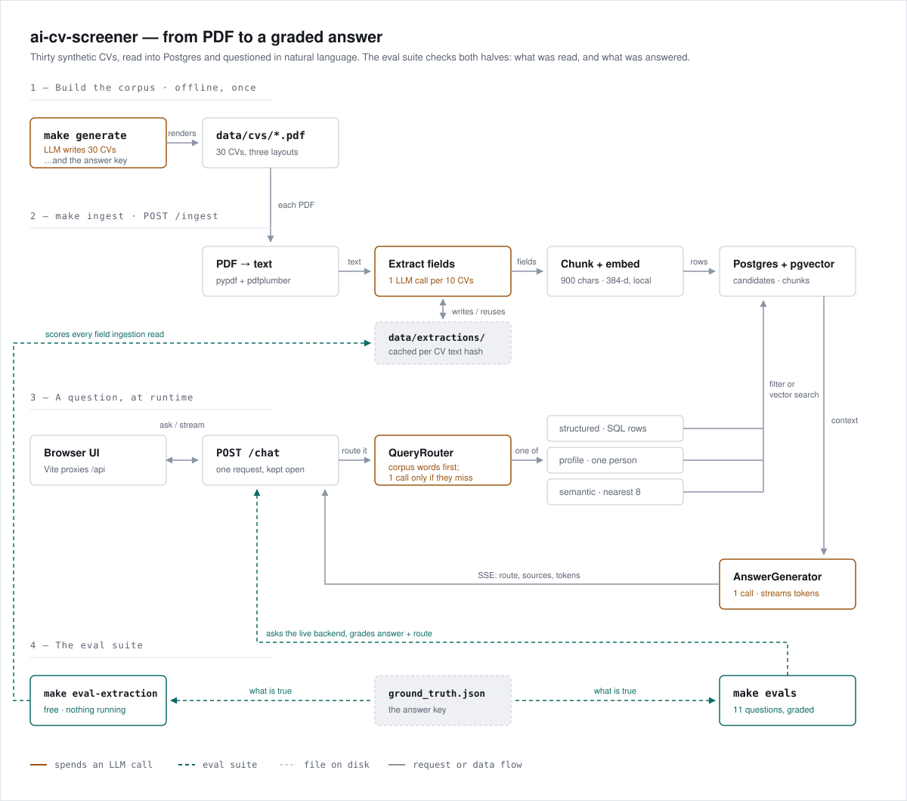

# ai-cv-screener
Welcome to the AI-Powered CV Screener!

Essentially A CV screening tool: a user asks questions in a chat interface and gets answers
grounded in a corpus of CVs, with the source CVs cited.

The project has four parts: a one-shot pipeline that generates a synthetic CV corpus; a backend
that ingests those CVs and answers questions about them; a web chat interface; and an eval suite
that grades what was read out of the CVs and what the backend answers.



*Also as a one-page A3 landscape sheet, with a note on what every step does:*
*[docs/WorkflowDiagram.pdf](docs/WorkflowDiagram.pdf).*


## Running it from scratch

You need **Python 3.12+**, **Node 20+**, **Docker** (running), and one LLM key.
The CV corpus is already committed, so there is nothing to generate on a fresh clone.

```sh
make install                  # checks your toolchain, builds the venv, installs Python and
                              # frontend deps, writes .env, and hands you a shell inside the venv
# open .env and paste your GEMINI_API_KEY
```

`make install` is the only setup step, and it leaves you **inside the venv** — it ends by
handing back an activated interactive shell, since a Makefile cannot activate anything in the
shell that called it. Type `exit` to come back out.

Every target that runs Python requires that venv to be active and stops with instructions if
it is not, so a stale terminal can never quietly run this project against your system Python.
`make db`, `make down` and `make ui` are exempt — Docker and npm, no Python involved:

```
$ make test
not inside this repo's venv (VIRTUAL_ENV=unset).
  activate it:  source .venv/bin/activate
  or set it up: make install
```

Then, in two terminals:

```sh
# terminal 1
make db                       # Postgres + pgvector, waits until ready
make api                      # backend on http://localhost:8000

# terminal 2
make ingest                   # reads data/cvs into the database — once
make ui                       # chat UI on http://localhost:5173
```

Open <http://localhost:5173> and ask something like *"who knows Kubernetes?"*.
`GET /health` reports how many candidates and chunks are in the database, and
`make down` stops Postgres when you are finished.

## Commands

Run `make` on its own to see this list.

| | |
|---|---|
| `make install` | one-shot setup: tool checks, venv, deps, `.env`, then a shell inside the venv |
| `make db` / `make down` | start / stop Postgres + pgvector |
| `make api` | backend on `BACKEND_API`'s port (:8000 by default), with reload |
| `make ui` | Vite dev server on :5173, proxying `/api` to the backend |
| `make ingest` | reads every CV in `data/cvs` into the database |
| `make generate` | rebuilds the corpus (`COUNT=5` for fewer) |
| `make regenerate` | rebuilds one CV from scratch, ignoring the cache (replaces `data/`) |
| `make eval-extraction` | scores ingestion against the answer key — free, nothing running |
| `make evals` | asks a running backend one question of each shape, and grades it |
| `make test` / `make test-fast` | full suite / skipping the corpus-backed tests |
| `make lint` / `make format` | ruff |

## Configuration

Everything lives in `.env` (copied from `.env.example`, gitignored).

- **A key is required**: `GEMINI_API_KEY` with `TEXT_PROVIDER=gemini`, or
  `OPENROUTER_API_KEY` with `TEXT_PROVIDER=openrouter`. The same key reads fields out
  of a CV and writes the answers.
- **Embeddings run locally**, so search itself costs nothing and needs no key, and the
  test suite never touches the network.
- **`DATABASE_URL`** already matches what `make db` starts.
- **`BACKEND_API`** is where the backend listens, in one place: `make api` binds its
  port, `make ingest` and `make evals` call it, and `make ui` proxies `/api` to it.
- **Token knobs** — the backend is tuned to spend as few *tokens* as possible, not as
  few calls (see [Backend](#backend)): `LLM_MAX_OUTPUT_TOKENS` caps the answer,
  `GEMINI_THINKING_LEVEL` stops the model buying reasoning it does not need, and
  `SEMANTIC_SEARCH_TOP_K` is how many chunks an open-ended question retrieves.

## Regenerating the corpus

Only needed if you want a different corpus. WeasyPrint needs two system libraries first:

```sh
brew install pango libffi                             # macOS
sudo apt install libpango-1.0-0 libpangoft2-1.0-0     # Debian/Ubuntu
```

```sh
make generate                 # 30 CVs; COUNT=5 while testing changes
.venv/bin/python -m data_generation.run --count 30 --force   # ignore what is on disk
```

Photos need no key: `IMAGE_PROVIDER` picks where to start and anything that fails falls
through to the next option. Re-run `make ingest` afterwards to load the new corpus.

# Design Decisions

## Corpus Generation Pipeline

### The corpus is synthetic on purpose

I can't put real CVs in a repo, so I generate fake ones. Nice side effect: I know
exactly what's in every CV, so later I can check whether the search actually finds
the right people. In other words: retrieval can later be graded against known
answers rather than hand-written guesses.
The evaluation quality of this project rests on that, which is why generation is a 
real pipeline rather than a fixture file.


### Candidate coordinates are fixed in code, before any model call

Before calling the model I pick each person's details in code (job, seniority,
city, where they studied). If you just ask a model for 30 people you get 30
versions of the same person, and then there's nothing to search for. This way I'm
asking it to write a CV for someone I already made up. I deal the options out like
cards so I don't end up with five people in Barcelona and none anywhere else, and
I work out years of experience from seniority so I don't get directors with two
years. It's all seeded, so I get the same 30 people every run.
As a result, a given corpus size always yields the same result. A failing test is 
then a real regression rather than a reshuffle.

### CV Content Builder

The builder returns JSON, not CV text. This way the record becomes an answer key,
it gets rendered into PDF later easily, and it can be checked field by field.
This is quite useful for evals and testing.
If we returned prose or CV text instead we would loose these benefits.

### Photo Builder

Photo Generation has three options, and it tries them in order: Gemini, then Pollinations
which needs no key, then it just draws a coloured circle with the person's
initials (as a local fallback not based on network).
This way we avoid missing a photo on a CV, even with just the initials is better than no
photo at all, also it's not worth killing a run that's already spent quota because of a broken network.

The photos never reach the search. They only exist so the PDFs look like real
documents.

### CV Renderer

There are five different CV layouts, and that's not for looks. Getting text back
out of a PDF is the step that quietly goes wrong, and it goes wrong differently
depending on how the page is arranged. Thirty identical CVs would test one code
path thirty times, hence why we have 5 different templates that are quite 
different in structure. The templates cycle by position rather than at random, 
so all five always show up.

### Corpus Generation Pipeline

It writes:

- `data/cvs/` — one PDF per candidate
- `data/photos/` — one JPEG per candidate
- `data/ground_truth.json` — the answer key, i.e. exactly what went into each CV

Two candidates sharing a name is something a real pile of CVs contains anyway, 
and the record still differs everywhere else, so there's nothing here re-requesting 
a record until it looks distinct enough.
Same for photos: each candidate has their own appearance line, and the headshot
that comes back is taken as-is.

The answer key gets rewritten after every single CV rather than once at the end.
If a run dies on number 18, I keep the 17 I already paid for.

## Backend

The backend is optimized for tokens, and three rules explain almost everything below: 
* don't send a word twice
* don't send a word nobody asked for
* don't call a model when something cheaper knows the answer.

### Ingesting the CVs

Turning a pile of PDFs into something answerable. Runs once, with `make ingest`.

```
PDF ─▶ text ─▶ [LLM] fields ─▶ chunks ─▶ vectors ─▶ Postgres
```

**1. Get the text out.** The fast reader (`pypdf`) handles almost every page; only
when it comes back nearly empty the slow, careful one (`pdfplumber`) is executed,
page by page, keeping whichever read more words. The two agree to within 1% of word
count, so the fallback fires on a broken page rather than on a hard layout.

**2. Ask a model for the facts.** Name, role, employer, skills, schools, and every job
with the years printed beside it — pulled into a fixed JSON shape. Ten CVs ride in one
call, not to save calls but so the instructions are sent once instead of ten times.

The model is asked for dates, never for durations. "How many years of experience" is
arithmetic, and asking for it put a 3 where the dates say 4 with nothing downstream able
to disagree. Career length, longest single tenure and the current job are all worked out
in code from the years it copied off the page — reproducible, free, and checkable against
the answer key (30/30 on years, 28/30 on job titles).

When you ask the AI about 10 CVs at once, it can mix up the order and give you Bob's details 
labeled as Anna's — so each result is only trusted if the surname it claims really shows up in that CV. 
The mismatched one gets re-asked by itself, and if it's still wrong, everything stops, because saving 
the wrong person's info would silently poison every future answer.

**3. Cut the text into chunks.** Embedding a whole CV gives one blurry vector that
matches everything and nothing. The cuts follow the CV's own headings, and each piece
repeats the tail of the one before it, so a sentence on a boundary survives whole
somewhere.

**4. Turn the chunks into vectors, locally.** A small model (`bge-small-en-v1.5`) runs
on the machine through ONNX. Hosted embeddings are billed per token like everything
else — on the whole corpus at every ingest, and on every question forever after. This
is the largest token bill in the system, and it simply doesn't exist.
In other words, the piece of a RAG system that usually costs the most here costs nothing at all.

**5. Store it.** Rows and vectors both land in Postgres, and the whole corpus is read
*before* anything is dropped — so a failure halfway leaves you the corpus you had five
minutes ago rather than none at all.

> **30 CVs = ~50k characters → 3 LLM calls, ~13k tokens in, ~4k out.** Once. Records
> are cached under a hash of the CV's text, so a re-ingest is free unless the text
> changed — and a regenerated CV reusing a filename misses the cache instead of
> inheriting the previous person's skills.

### Running it twice, and running it badly

The PDFs are the only thing that really matters. Everything else — the cache, the
tables, the vectors — can be thrown away and rebuilt from them, so there's no state
here worth being precious about.

- **Ingest again, unchanged.** Nearly free. Every CV is already in
  `data/extractions/`, so no model is called; the chunks and vectors are just
  recomputed locally, which costs seconds and no tokens.
- **Delete `data/extractions/` first.** You buy the whole corpus again — 3 calls,
  ~13k tokens, about 30 seconds on Gemini. Nothing breaks; it's just the one thing
  that costs money.
- **It dies halfway.** You keep the corpus you already had. The tables are only
  dropped once every CV has been read, so a failure in the expensive half leaves the
  previous 25 candidates answering questions as if nothing happened.
- **It succeeds.** `candidates` and `chunks` are dropped and rebuilt from empty, never
  patched. Regenerating the corpus invalidates every candidate id anyway, so an
  incremental path would just be a second way for the rows and the vectors to disagree.

### Answering a question

```
question ─▶ route ─▶ fetch context ─▶ [LLM] answer ─▶ stream to the browser
```

**1. Work out what kind of question it is.** Not every question is a search. "Who
knows Python" wants *everyone* who knows Python; "summarise Ana Silva" wants one
person; "who'd suit a startup" is a judgement call. Pick wrong and the answer is
confidently wrong:

| route | for | fetches |
|---|---|---|
| `structured` | filters, counts and rankings | a SQL `WHERE`, **every** match — or the top of an `ORDER BY` |
| `profile` | one named person | that person's CV |
| `semantic` | open-ended, qualitative | the 8 nearest chunks, at most 2 per CV |

Two things the router deliberately ignores or widens: a term that appears only after
"for example" is illustration, not a filter — filtering on the Python in "40% do backend
with Python" answered a question about thirty candidates with sixteen of them — and a
question asking how the corpus *divides up* takes every row rather than a filtered few.

**This step is usually free.** Recruiters name things — a person, a technology, a
university — and the database already knows every name, skill and school in the
corpus. Matching against that list is a string comparison, and string comparisons cost
nothing. The model only sees questions the corpus can't explain, which is where it was
earning its keep anyway.

**2. Fetch only what was asked for.** `structured` returns every match, because
similarity search cannot count: ask a vector search "who knows Python" and it returns
8 chunks whether 8 people match or 18, admitting nothing. But it sends the *narrowest*
row that still answers — names and skills, not employers and universities too.

A superlative — "who stayed longest in one job", "who has the longest experience in
Python" — is the one shape neither other route can answer: similarity search sees eight
chunks and cannot know it missed the ninth, and an unfiltered list hands the model thirty
rows and asks it to do the comparing, which is how the CV with the most bullet points
wins. So the ranking happens in SQL and only the head of it is sent, with a header saying
what was ranked and what the number does *not* mean — total career length is not years
spent using Python, and the answer has to say so.

`semantic` caps how many chunks any one CV contributes, and heads the context with a
line per candidate giving title and years. Unspread, one CV takes half the context and
wins on volume of evidence rather than on merit: asked for the best frontend engineer,
the system named a mid-level contractor with four dense chunks over the staff engineer
who had one.

`profile` resolves a name to candidate **ids** first, because names aren't
identifiers: the corpus can have two different people with the same one, and
filtering on the name would blend two careers into one incoherent profile. Their
chunks are stitched back together with the repeated edges removed.

**3. Answer, grounded and cited.** The retrieved text is the only information in
existence: no general knowledge, no filling-in, and "it's not in the CVs" is a valid
answer. 
Each claim carries its source file and the API serves those PDFs. The reply is
length-capped and reasoning is off, since output costs several times input and neither
job here is a reasoning problem — left on, the model streamed its own deliberation as
the answer and spent the budget before reaching one. It streams back as Server-Sent Events, route
label first, so the UI can say what it decided while the words are still arriving.

## Evals

Two suites, split by what they cost to run.

`make eval-extraction` needs nothing running and spends nothing. It scores what ingestion
read out of every CV against `data/ground_truth.json` — years exact, current role exact,
skill and institution recall — deriving each row exactly as the pipeline does, so it
measures what is in the database without needing the database. Today: **30/30 years,
26/30 roles, 99% skills, 90% institutions.**

`make evals` asks a running backend one question of each shape — aggregation, lookup,
profile, ranking, breakdown, qualitative, unanswerable — and grades the route and the
answer against the key. The questions are derived from the key rather than hardcoded, so
they stay correct when the corpus is regenerated and different people exist. There is no
LLM-as-judge: a grader that is itself a language model cannot tell "the system was wrong"
from "the grader was wrong", which is the one distinction this directory exists to make.

It earned its keep on the first run: it found that the skills filter compared whole
strings, so the 6 candidates whose CVs write "Python (pandas, NumPy)" were invisible to
"who knows Python" — on the route that exists precisely to return *every* match.

### Reading the output

`make eval-extraction` prints one row per metric: the score, the floor it has to clear,
and then every individual field that missed — so a failure names the CV to go and open.

```text
30 extractions scored against the answer key

metric               score        floor   result
------------------------------------------------------------
years exact          30/30        1.00    PASS (100%)
role exact           26/30        0.85    PASS (87%)
skill recall         382/384      0.95    PASS (99%)
institution recall   66/73        0.85    PASS (90%)

8 field(s) off:
  lucy-dubois.pdf: role exact — got 'Director, Data Engineer', key 'Freelance Data Engineering Consultant'
  arjun-sharma.pdf: institution recall — lost ['TU Delft']
  ...
```

Scores read as *hits / total*: the two exact metrics count one per CV, the two recalls
count one per list entry, so 382/384 means two skills out of 384 went missing across the
whole corpus. The floors sit a little under what the committed corpus measures, so
regenerating it with different people still passes but a real regression does not. Years
is the only metric at 1.00, because it is arithmetic over dates rather than reading: less
than exact means our own calculation is wrong.

`make evals` prints one row per question — its shape, the route the backend chose, and
what the grader made of the answer. Abridged here to five rows, with two failures
invented to show what they look like:

```text
11 cases over 30 candidates

kind           route       result  detail
------------------------------------------------------------------------------------------------
aggregation    structured  PASS    22 candidates hold Python
lookup         structured  FAIL    missing=['Jana Novák'] extra=[]
profile        semantic    FAIL    ok; routed semantic, expected profile
breakdown      structured  PASS    must see all 30 candidates and answer in proportions
unanswerable   structured  PASS    declined
...
------------------------------------------------------------------------------------------------
9/11 passed

NOT COVERED: no `ambiguous` case exists in this corpus.
  No two candidates share a name, so the disambiguation path is untested.
```

Each row is graded twice — on the answer and, separately, on the route that produced it —
and passes only if both are right. A correct answer down the wrong route (row three above)
is usually luck, and tends to stop being correct as soon as the corpus grows.

| detail | what went wrong |
|---|---|
| `missing=[...] extra=[...]` | wrong set of people: `missing` was forgotten, `extra` does not qualify |
| `did not name [...]` | a ranking that failed to name the winner |
| `retrieved N CVs, expected at least M` | retrieval narrowed the question before the model ever saw it |
| `routed X, expected Y` | wrong strategy — the answer may still read well |
| `did not decline` / `declined but still named [...]` | invented an answer the CVs do not contain |
| `cited no source` | an opinion with no CV behind it |
| `ERROR TimeoutError: ...` | the request never completed; a quota or a dead backend, not a wrong answer |

The `NOT COVERED` lines at the end are about the corpus, not the system: this corpus
happens to contain no two people sharing a name, so that shape could not be asked. It is
printed loudly but does not fail the run.

Exit codes are three rather than two, so CI can tell the cases apart: **0** everything
passed, **1** something was answered wrongly, **2** the suite could not run at all
(backend down, key out of quota). "We could not test it" is not "it is broken".

## What one question costs
  
  **One question = 1 call to the LLM.** Sending it costs ~500 tokens in, and it
  sends back ~150 tokens out. (A token is about ¾ of a word — you pay by the token,
  both directions.)

  Those ~500 tokens going in are two different things glued together:

  - **System (~120 tokens)** — the rulebook. The same every single time: "only use
    the CVs below, don't make things up, cite the file, be brief." The model forgets
    everything between questions, so we re-send the rules on every call. Like
    re-reading the game rules to a goldfish before each turn.

  - **Context (~370 tokens)** — the stuff we just looked up for *this* question:
    the bits of CVs we fetched, plus the question itself. Different every time.

  - **Out (~150 tokens)** — the answer it writes back.

  **Open-ended questions cost two calls instead of one.** Before we can look
  anything up, we have to ask the LLM "what kind of question is this — a filter, one
  person, or something vague?" That's the *classifier* (or *router*) call. Then the
  second call actually answers. So you pay twice: once to figure out where to look,
  once to answer.

### Where the tokens went

| | before | after |
|---|---|---|
| routing a typical question | ~290 tok | **0** — answered from the corpus |
| a "who knows X" answer prompt | 569 tok | 366 tok (−36%) |
| reading one CV on the profile route | 442 tok | 406 tok (−8%) |
| extraction instructions, per batch | 224 tok | 148 tok (−34%) |

Two things were deliberately left alone: the grounding rules, which are what stop the
model inventing a CV, and the length cap, which is never applied to the JSON
extraction calls — enforcing it there would truncate the object mid-write.

### Two more decisions

**One database, not two.** Postgres with `pgvector` keeps rows and vectors in the same
table, so "find similar text" and "filter by years of experience" are one query
language over one set of rows. A separate vector service would be another thing to
run, another thing to keep in sync, and mostly a bill.

**No response cache.** There was one, keyed on the model name and the full prompt, and
it was useful while tuning prompts. But a key can only hash what it can see: the same
name in front of retuned weights — a fine-tune, a provider upgrading a model underneath
you — replays yesterday's answer and nothing reveals it. Serving stale bytes and calling
it a hit is worse than paying for the call, so extraction is the only thing cached, on
the CV text that produced it.

### What it leaves on disk

* It only ever reads `data/cvs/`
* It writes `data/extractions/` (one JSON per CV plus a hash of its text — what makes a
  re-ingest free), which is safe to delete: the next ingest buys it again
* The Postgres volume is rewritten on every ingest, and reset with `docker compose down -v`
